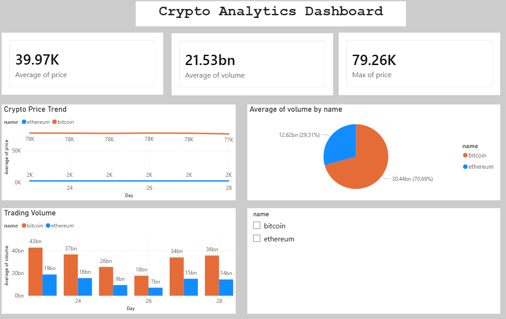

```markdown
# Crypto Analytics Dashboard

An end-to-end data analytics and data engineering project that fetches live Bitcoin and Ethereum data, stores it in a PostgreSQL database, and visualizes it through Streamlit and Power BI dashboards.

## Tech Stack
- Python
- PostgreSQL
- Pandas
- Streamlit
- Power BI

## Features
- Fetches hourly Bitcoin and Ethereum price and volume data from CoinGecko API
- Stores 700+ records in PostgreSQL database
- Calculates 7-day moving average and daily returns
- Interactive web dashboard built with Streamlit
- Business intelligence dashboard built with Power BI

## Project Structure
```
crypto-analytics/
├── app/
│   ├── main.py
│   ├── api.py
│   ├── charts.py
│   ├── db_conn.py
│   ├── save_to_db.py
│   ├── export_to_excel.py
│   └── dashboard.py
├── screenshots/
├── requirements.txt
├── .gitignore
└── README.md
```

## Screenshots

### Streamlit Dashboard


### Power BI Dashboard


## How to Run

1. Install dependencies
```
pip install -r requirements.txt
```

2. Run the pipeline
```
python main.py
```

3. Run the dashboard
```
streamlit run dashboard.py
```

## What I Learned
- Building automated data pipelines
- Storing and querying data with PostgreSQL
- Data analysis with Pandas
- Building dashboards with Streamlit and Power BI
```

---

